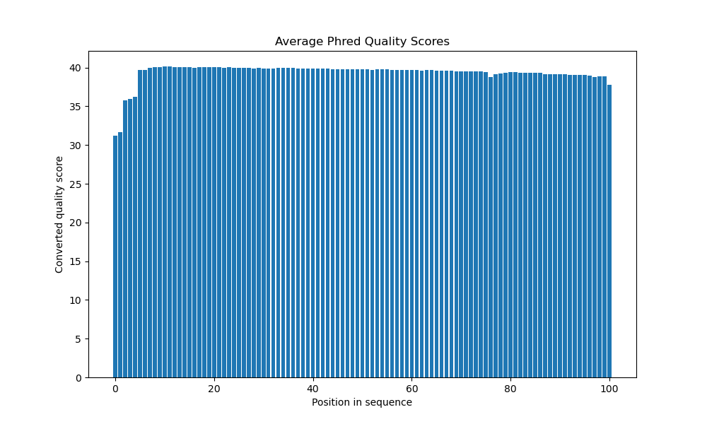
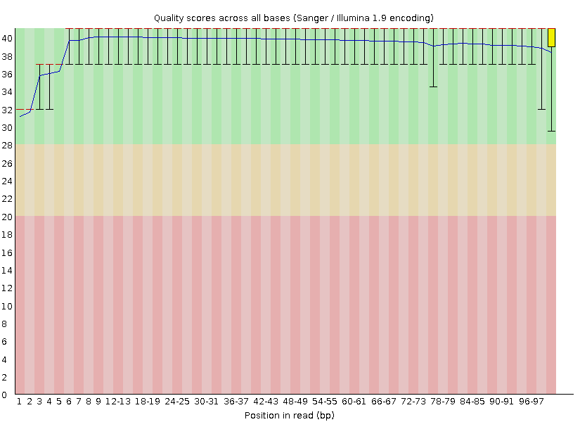
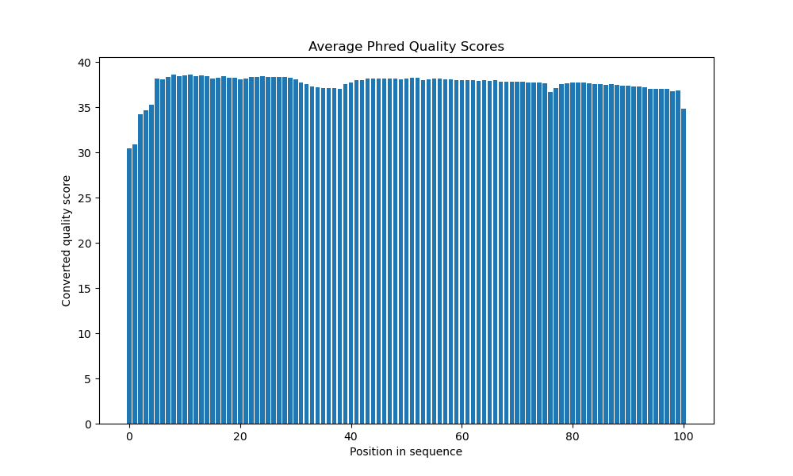
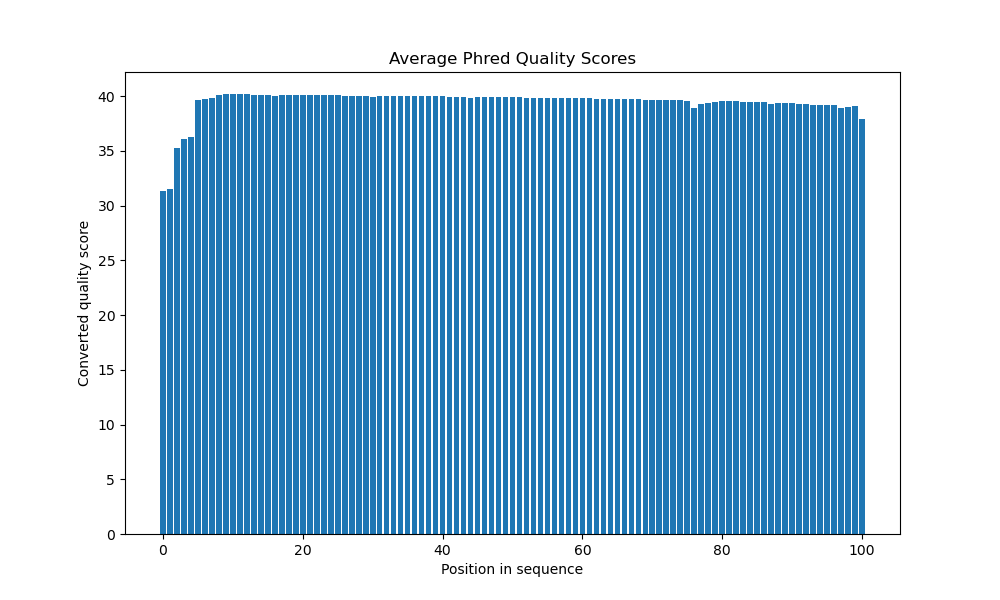
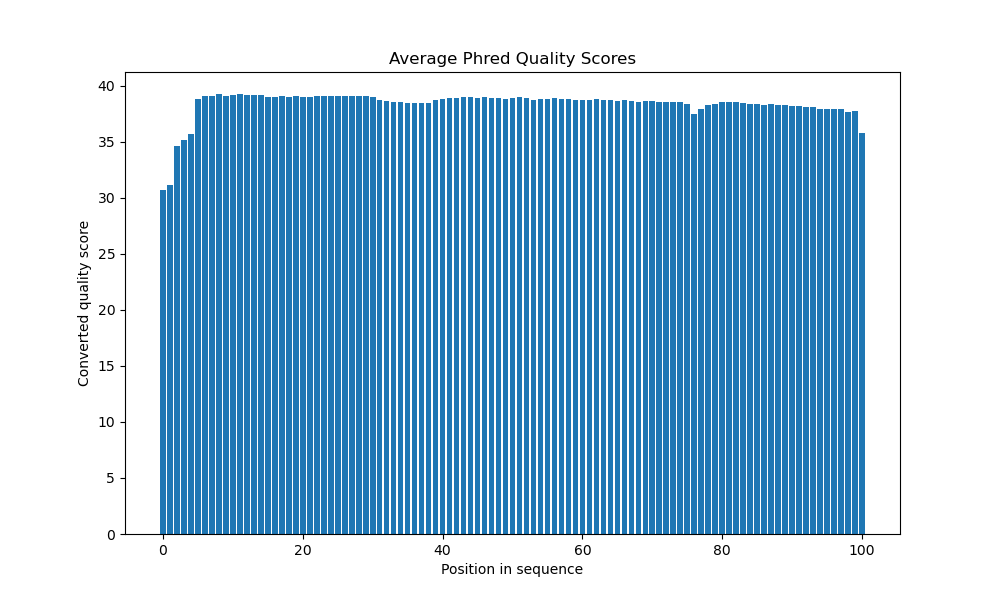
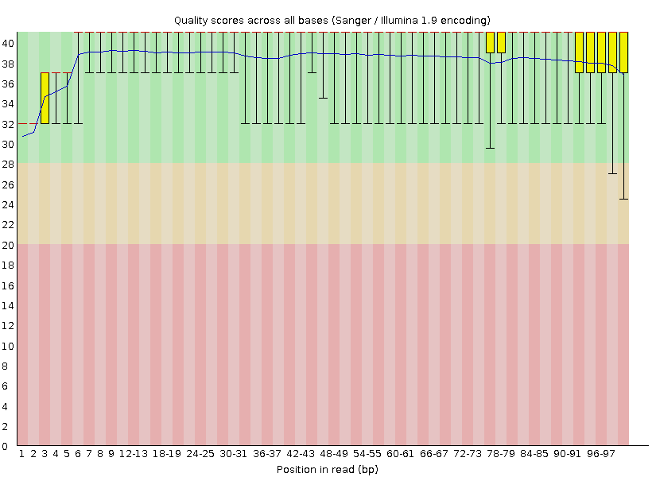
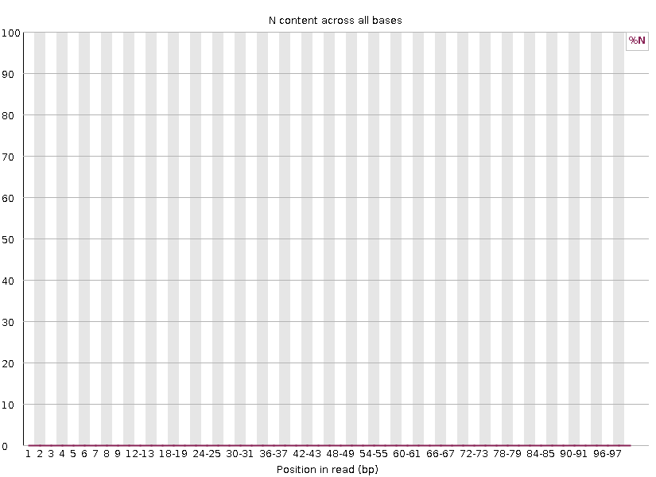
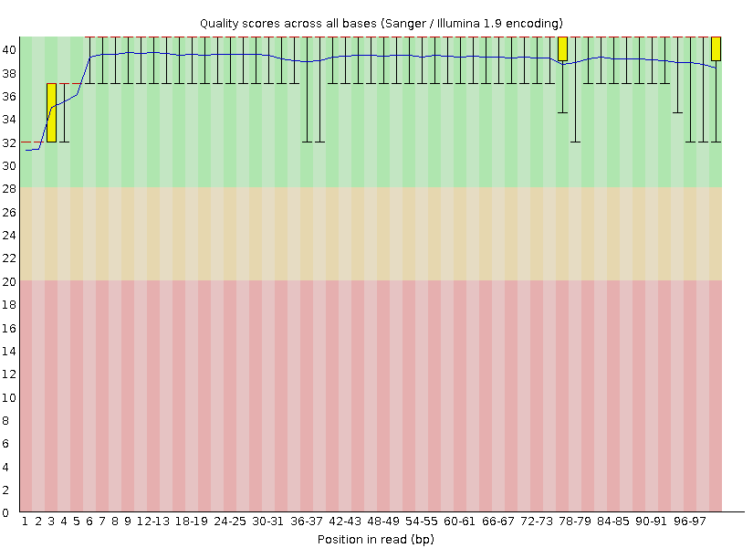

The objectives of this assignment are to:
1. Evaluate quality of RNA-Seq data using FastQC before and after removing adapters and trimming low quality reads. 
2. Compare custom python script to the output of FastQC. 
3. Connect concepts and tools developed in previous assignments. 
4. Determine and justify stranded-ness of the data. 

Data files assigned to process (R1 and R2):
- 27_4C_mbnl_S19_L008	
- 32_4G_both_S23_L008

The plots I generated are basically the same in terms of what information they displey, however the FastQc plots include error bars, which might be variance or interquartile range. 

The read 1 files' quality is much better than the read 2s' quality score but that is due to the reads being later in the sequencing run.  

Overall, this data seems to be of good quality, none of the error bars of fastqc output seem to have dipped into the red regions so that must at least be sufficient quality to do something with.

### FastQC outputs from raw files and the custom outputs too (myplot)

### 27_4C_mbnl_S19_L008_R1

### 27_4C_mbnl_S19_L008_R2

### 32_4G_both_S23_L008_R1

### 32_4G_both_S23_L008_R2

Table of the times and memory for each of these commands as timed with `/usr/bin/time -v`

| File | FastQC Time | FastQC Memory (kbytes)| mean_qual.py Time | mean_qual.py Memory (kbytes) |
| :---: 	| :---: 	| :---: 	| :---: | :---: |
| 27_4C_mbnl_S19_L008_R1 | 0:31.36 | 370344 | 1:36.44 | 65688 |
| 27_4C_mbnl_S19_L008_R2 | 0:30.18 | 367432 | 1:29.58 | 65612 |
| 32_4G_both_S23_L008_R1 | 0:46.33 | 345816 | 2:26.40 | 63568 |
| 32_4G_both_S23_L008_R2 | 0:46.21 | 349428 | 2:26.72 | 65540 |

<!-- Colons in the --- row specify column alignment -->

---

After these first plots, data are adapter trimmed using `cutadapt` and then quality trimmed with `trimmomatic`. 
Using another custom pyplot script, plot the distributions of read lengths also. 

Cutadapt information: 
- Sample 27_4C_mbnl_S19_L008
  - Total read pairs processed:          7,226,430
    - Read 1 with adapter:                 751,117 (10.4%)
    - Read 2 with adapter:                 803,568 (11.1%)
  - Pairs written (passing filters):     7,226,430 (100.0%)
- Sample 32_4G_both_S23_L008
  - Total read pairs processed:         11,820,174
    - Read 1 with adapter:                 631,720 (5.3%)
    - Read 2 with adapter:                 725,571 (6.1%)
  - Pairs written (passing filters):    11,820,174 (100.0%)
  
#### 27_4C_mbnl_S19_L008

#### 32_4G_both_S23_L008

### 27_4C_mbnl_S19_L008_R1

### 27_4C_mbnl_S19_L008_R2

### 32_4G_both_S23_L008_R1

### 32_4G_both_S23_L008_R2

---

Create an alignment database for *M. musculus* using STAR RNA-Seq aligner. Align both samples to this database. Using `htseq-count`, reads which mapped to features were counted for both `--stranded=yes` and `--stranded=reverse`

Results of STAR alignment: 

| Sample | Reads Mapped | Reads Not Mapped | 
| :---: |:---: |:---: |
| 27_4C_mbnl_S19_L008 | 13320032 | 433878 | 
| 32_4G_both_S23_L008 | 22404331 | 533601 |

The data are from strand specific RNA-Seq libraries. The vast majority of reads (82.701%, 86.4336%) were mapped using `--stranded=reverse`, while only 3.91303%, 3.82643% mapped using `--stranded=yes` for samples 27_4C_mbnl_S19_L008 and 32_4G_both_S23_L008 respectively. I used commands from ICA4 in Bi621.
