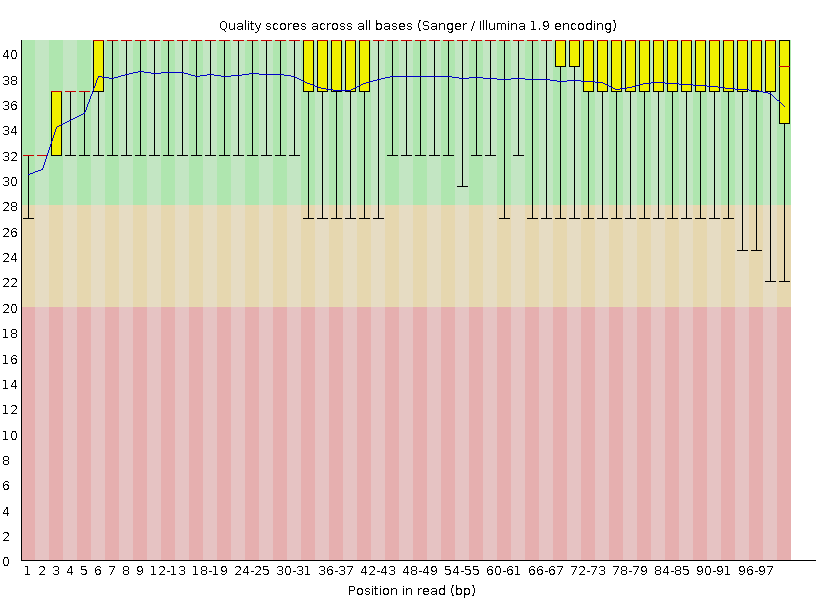

## 2024-08-22

The objective of this assignment is to use tools for quality assessment, adapter trimming and to compare these to my own software.

For the data I will be using, consult `/projects/bgmp/shared/Bi623/QAA_data_assignments.txt`:
```
$ cat /projects/bgmp/shared/Bi623/QAA_data_assignments.txt
Student	Fileset 1	Fileset 2
Abraham	32_4G_both_S23_L008	3_2B_control_S3_L008
Amelia	2_2B_control_S2_L008	19_3F_fox_S14_L008
Ben	7_2E_fox_S6_L008	Undetermined_S0_L008
Cam	21_3G_both_S15_L008	16_3D_mbnl_S12_L008
Carly	1_2A_control_S1_L008	24_4A_control_S18_L008
Carter	29_4E_fox_S21_L008	11_2H_both_S9_L008
Claire	11_2H_both_S9_L008	14_3B_control_S10_L008
Evan	28_4D_mbnl_S20_L008	2_2B_control_S2_L008
Grace	15_3C_mbnl_S11_L008	17_3E_fox_S13_L008
Jackson	Undetermined_S0_L008	29_4E_fox_S21_L008
Jules	16_3D_mbnl_S12_L008	6_2D_mbnl_S5_L008
Julia	34_4H_both_S24_L008	21_3G_both_S15_L008
Kenneth	6_2D_mbnl_S5_L008	1_2A_control_S1_L008
Lauren	8_2F_fox_S7_L008	22_3H_both_S16_L008
Lena	14_3B_control_S10_L008	8_2F_fox_S7_L008
Mahmoud	31_4F_fox_S22_L008	10_2G_both_S8_L008
Maura	4_2C_mbnl_S4_L008	34_4H_both_S24_L008
Ramzy	22_3H_both_S16_L008	23_4A_control_S17_L008
Shayal	24_4A_control_S18_L008	15_3C_mbnl_S11_L008
Tayana	17_3E_fox_S13_L008	27_4C_mbnl_S19_L008
Varsheni	19_3F_fox_S14_L008	7_2E_fox_S6_L008
Wes	27_4C_mbnl_S19_L008	32_4G_both_S23_L008
Zach	3_2B_control_S3_L008	28_4D_mbnl_S20_L008
```

My name is `Wes` so I will use files `27_4C_mbnl_S19_L008` and `32_4G_both_S23_L008` (R1 and R2 for each of these files, so 4 total).  

The demultiplexed, gzipped `.fastq` files are here: ```/projects/bgmp/shared/2017_sequencing/demultiplexed/```

```
Input files:
/projects/bgmp/shared/2017_sequencing/demultiplexed/27_4C_mbnl_S19_L008_R1_001.fastq.gz
/projects/bgmp/shared/2017_sequencing/demultiplexed/27_4C_mbnl_S19_L008_R2_001.fastq.gz
/projects/bgmp/shared/2017_sequencing/demultiplexed/32_4G_both_S23_L008_R1_001.fastq.gz
/projects/bgmp/shared/2017_sequencing/demultiplexed/32_4G_both_S23_L008_R2_001.fastq.gz
```

Do not move, copy, or unzip this data!

# Part 1

## 2024-08-25

Enter an interactive session on Talapas.
```srun --account=bgmp --partition=bgmp --time=2:00:00 --pty bash```

Create a new conda environment named `QAA`. Install `FastQC`
- Version should be 0.12.1
```
$ conda create -y -n QAA fastqc=0.12.1
$ conda activate QAA
$ conda list
```

<details>

  <summary>`conda list`</summary>

```
# packages in environment at /projects/bgmp/wesg/miniforge3/envs/QAA:                          
#                                                                                              
# Name                    Version                   Build  Channel                             
_libgcc_mutex             0.1                 conda_forge    conda-forge                       
_openmp_mutex             4.5                       2_gnu    conda-forge
alsa-lib                  1.2.12               h4ab18f5_0    conda-forge
bzip2                     1.0.8                h4bc722e_7    conda-forge
ca-certificates           2024.7.4             hbcca054_0    conda-forge
cairo                     1.18.0               hebfffa5_3    conda-forge
expat                     2.6.2                h59595ed_0    conda-forge
fastqc                    0.12.1               hdfd78af_0    bioconda
font-ttf-dejavu-sans-mono 2.37                 hab24e00_0    conda-forge
font-ttf-inconsolata      3.000                h77eed37_0    conda-forge
font-ttf-source-code-pro  2.038                h77eed37_0    conda-forge
font-ttf-ubuntu           0.83                 h77eed37_2    conda-forge
fontconfig                2.14.2               h14ed4e7_0    conda-forge
fonts-conda-ecosystem     1                             0    conda-forge
fonts-conda-forge         1                             0    conda-forge
freetype                  2.12.1               h267a509_2    conda-forge
giflib                    5.2.2                hd590300_0    conda-forge
graphite2                 1.3.13            h59595ed_1003    conda-forge
harfbuzz                  9.0.0                hda332d3_1    conda-forge
icu                       75.1                 he02047a_0    conda-forge
keyutils                  1.6.1                h166bdaf_0    conda-forge
krb5                      1.21.3               h659f571_0    conda-forge
lcms2                     2.16                 hb7c19ff_0    conda-forge
lerc                      4.0.0                h27087fc_0    conda-forge
libcups                   2.3.3                h4637d8d_4    conda-forge
libdeflate                1.21                 h4bc722e_0    conda-forge
libedit                   3.1.20191231         he28a2e2_2    conda-forge
libexpat                  2.6.2                h59595ed_0    conda-forge
libffi                    3.4.2                h7f98852_5    conda-forge
libgcc-ng                 14.1.0               h77fa898_0    conda-forge
libglib                   2.80.3               h315aac3_2    conda-forge
libgomp                   14.1.0               h77fa898_0    conda-forge
libiconv                  1.17                 hd590300_2    conda-forge
libjpeg-turbo             3.0.0                hd590300_1    conda-forge
libpng                    1.6.43               h2797004_0    conda-forge
libstdcxx-ng              14.1.0               hc0a3c3a_0    conda-forge
libtiff                   4.6.0                h46a8edc_4    conda-forge
libuuid                   2.38.1               h0b41bf4_0    conda-forge
libwebp-base              1.4.0                hd590300_0    conda-forge
libxcb                    1.16                 hb9d3cd8_1    conda-forge
libxcrypt                 4.4.36               hd590300_1    conda-forge
libzlib                   1.3.1                h4ab18f5_1    conda-forge
ncurses                   6.5                  h59595ed_0    conda-forge
openjdk                   22.0.1               h8651b0f_1    conda-forge
openssl                   3.3.1                hb9d3cd8_3    conda-forge
pcre2                     10.44                hba22ea6_2    conda-forge
perl                      5.32.1          7_hd590300_perl5    conda-forge
pixman                    0.43.2               h59595ed_0    conda-forge
pthread-stubs             0.4               h36c2ea0_1001    conda-forge
xorg-fixesproto           5.0               h7f98852_1002    conda-forge
xorg-inputproto           2.3.2             h7f98852_1002    conda-forge
xorg-kbproto              1.0.7             h7f98852_1002    conda-forge
xorg-libice               1.1.1                hd590300_0    conda-forge
xorg-libsm                1.2.4                h7391055_0    conda-forge
xorg-libx11               1.8.9                hb711507_1    conda-forge
xorg-libxau               1.0.11               hd590300_0    conda-forge
xorg-libxdmcp             1.1.3                h7f98852_0    conda-forge
xorg-libxext              1.3.4                h0b41bf4_2    conda-forge
xorg-libxfixes            5.0.3             h7f98852_1004    conda-forge
xorg-libxi                1.7.10               h4bc722e_1    conda-forge
xorg-libxrender           0.9.11               hd590300_0    conda-forge
xorg-libxt                1.3.0                hd590300_1    conda-forge
xorg-libxtst              1.2.5                h4bc722e_0    conda-forge
xorg-recordproto          1.14.2            h7f98852_1002    conda-forge
xorg-renderproto          0.11.1            h7f98852_1002    conda-forge
xorg-xextproto            7.3.0             h0b41bf4_1003    conda-forge
xorg-xproto               7.0.31            h7f98852_1007    conda-forge
xz                        5.2.6                h166bdaf_0    conda-forge
zlib                      1.3.1                h4ab18f5_1    conda-forge
zstd                      1.5.6                ha6fb4c9_0    conda-forge
```

</details>

## 2024-08-28

Read `fastqc --help > fastqhelp.txt`

In an interactive session: 

```
mkdir /projects/bgmp/wesg/bioinfo/Bi623/QAA/fqcout_raw
cd /projects/bgmp/shared/2017_sequencing/demultiplexed
conda activate QAA
fastqc -o /projects/bgmp/wesg/bioinfo/Bi623/QAA/fqcout_raw --noextract -f fastq 27_4C_mbnl_S19_L008_R1_001.fastq.gz 27_4C_mbnl_S19_L008_R2_001.fastq.gz 32_4G_both_S23_L008_R1_001.fastq.gz 32_4G_both_S23_L008_R2_001.fastq.gz
```

## 2024-09-02

Unzip these fastqc outputs and move them to folder for reporting. 

```
cd fqcout_raw
unzip 27_4C_mbnl_S19_L008_R1_001_fastqc.zip
unzip 27_4C_mbnl_S19_L008_R2_001_fastqc.zip
unzip 32_4G_both_S23_L008_R1_001_fastqc.zip
unzip 32_4G_both_S23_L008_R2_001_fastqc.zip
mkdir report
cp 27_4C_mbnl_S19_L008_R1_001_fastqc/Images/per_base_quality.png report/27_R1_per_base_quality.png
cp 27_4C_mbnl_S19_L008_R2_001_fastqc/Images/per_base_quality.png report/27_R2_per_base_quality.png
cp 32_4G_both_S23_L008_R1_001_fastqc/Images/per_base_quality.png report/32_R1_per_base_quality.png
cp 32_4G_both_S23_L008_R2_001_fastqc/Images/per_base_quality.png report/32_R2_per_base_quality.png
cp 27_4C_mbnl_S19_L008_R1_001_fastqc/Images/per_base_n_content.png report/27_R1_per_base_n_content.png
cp 27_4C_mbnl_S19_L008_R2_001_fastqc/Images/per_base_n_content.png report/27_R2_per_base_n_content.png
cp 32_4G_both_S23_L008_R1_001_fastqc/Images/per_base_n_content.png report/32_R1_per_base_n_content.png
cp 32_4G_both_S23_L008_R2_001_fastqc/Images/per_base_n_content.png report/32_R2_per_base_n_content.png
# Remove these unzipped data  
rm -r 27_4C_mbnl_S19_L008_R1_001_fastqc
rm -r 27_4C_mbnl_S19_L008_R2_001_fastqc
rm -r 32_4G_both_S23_L008_R1_001_fastqc
rm -r 32_4G_both_S23_L008_R2_001_fastqc
cd ..
```

Script [mean_qual.py](./mean_qual.py) from demultiplex assignment. I had to edit it slightly, it only produces plot for a single file at a time, which it now takes in with argparse. I renamed it from `mean_qual_fq.py` as it was in the demultiplex assignment. 

I need to re-run the fastqc of the data in a slurm script using `/usr/bin/time -v ` commands so that I compare to the python script that I made for assignment demultiplexing in Bi622

[comp_demultplexqc.sh](./comp_demultiplexqc.sh)

The plots I generated are basically the same in terms of what information they displey, however the FastQc plots include error bars, which might be variance or interquartile range. 

See [slurm-15932418.out](./slurm-15932418.out) for time of each of these commands. 

The read 1 files' quality is much better than the read 2s' quality score but that is due to the reads being later in the sequencing run.  

Overall, this data seems to be of good quality, none of the error bars of fastqc output seem to have dipped into the red regions so that must at least be sufficient quality to do something with.

### FastQC outputs from raw files

### 27_4C_mbnl_S19_L008_R1


### 27_4C_mbnl_S19_L008_R2




### 32_4G_both_S23_L008_R1


### 32_4G_both_S23_L008_R2


Table of the times and memory for each of these commands as timed with `/usr/bin/time -v`
| Program | FastQC |FastQC| Custom | Custom | 
| File | Time |  Memory (kbytes)| Time | Memory (kbytes) |
| --- 	| --- 	| --- 	| 
| 27_4C_mbnl_S19_L008_R1 | 0:31.36 | 370344 | 1:36.44 | 65688 |
| 27_4C_mbnl_S19_L008_R2 | 0:30.18 | 367432 | 1:29.58 | 65612 |
| 32_4G_both_S23_L008_R1 | 0:46.33 | 345816 | 2:26.40 | 63568 |
| 32_4G_both_S23_L008_R2 | 0:46.21 | 349428 | 2:26.72 | 65540 |

## 2024-09-06

# Part 2

Install:
- `cutadapt` Version 4.9
- `trimmomatic` Version 0.39

```
conda activate QAA
conda install cutadapt=4.9
conda install trimmomatic=0.39
```

Read `man` page for `cutadapt`. 

<details>   
<summary> `cutadapt --help` </summary> 
<br> 

```
cutadapt version 4.9

Copyright (C) 2010 Marcel Martin <marcel.martin@scilifelab.se> and contributors

Cutadapt removes adapter sequences from high-throughput sequencing reads.

Usage:
    cutadapt -a ADAPTER [options] [-o output.fastq] input.fastq

For paired-end reads:
    cutadapt -a ADAPT1 -A ADAPT2 [options] -o out1.fastq -p out2.fastq in1.fastq in2.fastq

Replace "ADAPTER" with the actual sequence of your 3' adapter. IUPAC wildcard
characters are supported. All reads from input.fastq will be written to
output.fastq with the adapter sequence removed. Adapter matching is
error-tolerant. Multiple adapter sequences can be given (use further -a
options), but only the best-matching adapter will be removed.

Input may also be in FASTA format. Compressed input and output is supported and
auto-detected from the file name (.gz, .xz, .bz2). Use the file name '-' for
standard input/output. Without the -o option, output is sent to standard output.

Citation:

Marcel Martin. Cutadapt removes adapter sequences from high-throughput
sequencing reads. EMBnet.Journal, 17(1):10-12, May 2011.
http://dx.doi.org/10.14806/ej.17.1.200

Run "cutadapt --help" to see all command-line options.
See https://cutadapt.readthedocs.io/ for full documentation.

Options:
  -h, --help            Show this help message and exit
  --version             Show version number and exit
  --debug               Print debug log. Use twice to also print DP matrices
  -j CORES, --cores CORES
                        Number of CPU cores to use. Use 0 to auto-detect. Default: 1

Finding adapters:
  Parameters -a, -g, -b specify adapters to be removed from each read (or from R1 if data is paired-
  end. If specified multiple times, only the best matching adapter is trimmed (but see the --times
  option). Use notation 'file:FILE' to read adapter sequences from a FASTA file.

  -a ADAPTER, --adapter ADAPTER
                        Sequence of an adapter ligated to the 3' end (paired data: of the first read).
                        The adapter and subsequent bases are trimmed. If a '$' character is appended
                        ('anchoring'), the adapter is only found if it is a suffix of the read.
  -g ADAPTER, --front ADAPTER
                        Sequence of an adapter ligated to the 5' end (paired data: of the first read).
                        The adapter and any preceding bases are trimmed. Partial matches at the 5' end
                        are allowed. If a '^' character is prepended ('anchoring'), the adapter is only
                        found if it is a prefix of the read.
  -b ADAPTER, --anywhere ADAPTER
                        Sequence of an adapter that may be ligated to the 5' or 3' end (paired data: of
                        the first read). Both types of matches as described under -a and -g are allowed.
                        If the first base of the read is part of the match, the behavior is as with -g,
                        otherwise as with -a. This option is mostly for rescuing failed library
                        preparations - do not use if you know which end your adapter was ligated to!
  -e E, --error-rate E, --errors E
                        Maximum allowed error rate (if 0 <= E < 1), or absolute number of errors for
                        full-length adapter match (if E is an integer >= 1). Error rate = no. of errors
                        divided by length of matching region. Default: 0.1 (10%)
  --no-indels           Allow only mismatches in alignments. Default: allow both mismatches and indels
  -n COUNT, --times COUNT
                        Remove up to COUNT adapters from each read. Default: 1
  -O MINLENGTH, --overlap MINLENGTH
                        Require MINLENGTH overlap between read and adapter for an adapter to be found.
                        Default: 3
  --match-read-wildcards
                        Interpret IUPAC wildcards in reads. Default: False
  -N, --no-match-adapter-wildcards
                        Do not interpret IUPAC wildcards in adapters.
  --action {trim,retain,mask,lowercase,crop,none}
                        What to do if a match was found. trim: trim adapter and up- or downstream
                        sequence; retain: trim, but retain adapter; mask: replace with 'N' characters;
                        lowercase: convert to lowercase; crop: trim up and downstream sequence; none:
                        leave unchanged. Default: trim
  --rc, --revcomp       Check both the read and its reverse complement for adapter matches. If match is
                        on reverse-complemented version, output that one. Default: check only read

Additional read modifications:
  -u LEN, --cut LEN     Remove LEN bases from each read (or R1 if paired; use -U option for R2). If LEN
                        is positive, remove bases from the beginning. If LEN is negative, remove bases
                        from the end. Can be used twice if LENs have different signs. Applied *before*
                        adapter trimming.
  --nextseq-trim 3'CUTOFF
                        NextSeq-specific quality trimming (each read). Trims also dark cycles appearing
                        as high-quality G bases.
  -q [5'CUTOFF,]3'CUTOFF, --quality-cutoff [5'CUTOFF,]3'CUTOFF
                        Trim low-quality bases from 5' and/or 3' ends of each read before adapter
                        removal. Applied to both reads if data is paired. If one value is given, only
                        the 3' end is trimmed. If two comma-separated cutoffs are given, the 5' end is
                        trimmed with the first cutoff, the 3' end with the second.
  --quality-base N      Assume that quality values in FASTQ are encoded as ascii(quality + N). This
                        needs to be set to 64 for some old Illumina FASTQ files. Default: 33
  --poly-a              Trim poly-A tails
  --length LENGTH, -l LENGTH
                        Shorten reads to LENGTH. Positive values remove bases at the end while negative
                        ones remove bases at the beginning. This and the following modifications are
                        applied after adapter trimming.
  --trim-n              Trim N's on ends of reads.
  --length-tag TAG      Search for TAG followed by a decimal number in the description field of the
                        read. Replace the decimal number with the correct length of the trimmed read.
                        For example, use --length-tag 'length=' to correct fields like 'length=123'.
  --strip-suffix STRIP_SUFFIX
                        Remove this suffix from read names if present. Can be given multiple times.
  -x PREFIX, --prefix PREFIX
                        Add this prefix to read names. Use {name} to insert the name of the matching
                        adapter.
  -y SUFFIX, --suffix SUFFIX
                        Add this suffix to read names; can also include {name}
  --rename TEMPLATE     Rename reads using TEMPLATE containing variables such as {id}, {adapter_name}
                        etc. (see documentation)
  --zero-cap, -z        Change negative quality values to zero.

Filtering of processed reads:
  Filters are applied after above read modifications. Paired-end reads are always discarded pairwise
  (see also --pair-filter).

  -m LEN[:LEN2], --minimum-length LEN[:LEN2]
                        Discard reads shorter than LEN. Default: 0
  -M LEN[:LEN2], --maximum-length LEN[:LEN2]
                        Discard reads longer than LEN. Default: no limit
  --max-n COUNT         Discard reads with more than COUNT 'N' bases. If COUNT is a number between 0 and
                        1, it is interpreted as a fraction of the read length.
  --max-expected-errors ERRORS, --max-ee ERRORS
                        Discard reads whose expected number of errors (computed from quality values)
                        exceeds ERRORS.
  --max-average-error-rate ERROR_RATE, --max-aer ERROR_RATE
                        as --max-expected-errors (see above), but divided by length to account for reads
                        of varying length.
  --discard-trimmed, --discard
                        Discard reads that contain an adapter. Use also -O to avoid discarding too many
                        randomly matching reads.
  --discard-untrimmed, --trimmed-only
                        Discard reads that do not contain an adapter.
  --discard-casava      Discard reads that did not pass CASAVA filtering (header has :Y:).

Output:
  --quiet               Print only error messages.
  --report {full,minimal}
                        Which type of report to print: 'full' or 'minimal'. Default: full
  --json FILE           Dump report in JSON format to FILE
  -o FILE, --output FILE
                        Write trimmed reads to FILE. FASTQ or FASTA format is chosen depending on input.
                        Summary report is sent to standard output. Use '{name}' for demultiplexing (see
                        docs). Default: write to standard output
  --fasta               Output FASTA to standard output even on FASTQ input.
  -Z                    Use compression level 1 for gzipped output files (faster, but uses more space)
  --info-file FILE      Write information about each read and its adapter matches into FILE. See the
                        documentation for the file format.
  -r FILE, --rest-file FILE
                        When the adapter matches in the middle of a read, write the rest (after the
                        adapter) to FILE.
  --wildcard-file FILE  When the adapter has N wildcard bases, write adapter bases matching wildcard
                        positions to FILE. (Inaccurate with indels.)
  --too-short-output FILE
                        Write reads that are too short (according to length specified by -m) to FILE.
                        Default: discard reads
  --too-long-output FILE
                        Write reads that are too long (according to length specified by -M) to FILE.
                        Default: discard reads
  --untrimmed-output FILE
                        Write reads that do not contain any adapter to FILE. Default: output to same
                        file as trimmed reads

Paired-end options:
  The -A/-G/-B/-U/-Q options work like their lowercase counterparts, but are applied to R2 (second
  read in pair)

  -A ADAPTER            3' adapter to be removed from R2
  -G ADAPTER            5' adapter to be removed from R2
  -B ADAPTER            5'/3 adapter to be removed from R2
  -U LENGTH             Remove LENGTH bases from R2
  -Q [5'CUTOFF,]3'CUTOFF
                        Quality-trimming cutoff for R2. Default: same as for R1
  -L LENGTH             Shorten R2 to LENGTH. Default: same as for R1
  -p FILE, --paired-output FILE
                        Write R2 to FILE.
  --pair-adapters       Treat adapters given with -a/-A etc. as pairs. Either both or none are removed
                        from each read pair.
  --pair-filter {any,both,first}
                        Which of the reads in a paired-end read have to match the filtering criterion in
                        order for the pair to be filtered. Default: any
  --interleaved         Read and/or write interleaved paired-end reads.
  --untrimmed-paired-output FILE
                        Write second read in a pair to this FILE when no adapter was found. Use with
                        --untrimmed-output. Default: output to same file as trimmed reads
  --too-short-paired-output FILE
                        Write second read in a pair to this file if pair is too short.
  --too-long-paired-output FILE
                        Write second read in a pair to this file if pair is too long.
```
</details> 

<details>   

<summary> `trimmomatic --help` </summary> 

<br> 

```

Usage:
       PE [-version] [-threads <threads>] [-phred33|-phred64] [-trimlog <trimLogFile>] [-summary <statsSummaryFile>] [-quiet] [-validatePairs] [-basein <inputBase> | <inputFile1> <inputFile2>] [-baseout <outputBase> | <outputFile1P> <outputFile1U> <outputFile2P> <outputFile2U>] <trimmer1>...
   or:
       SE [-version] [-threads <threads>] [-phred33|-phred64] [-trimlog <trimLogFile>] [-summary <statsSummaryFile>] [-quiet] <inputFile> <outputFile> <trimmer1>...
   or:
       -version

```

</details>   

In script [cutntrim.sh](cutntrim.sh) these samples are adapter trimmed and then quality trimmed. I create a custom plotting script [pairedreadlengthdist.py](pairedreadlengthdist.py). Afterwards make fastqc outputs to compare to the raw reads. 

Using `cutadapt` trim adapter sequences from these files. Use default settings. What proportion of reads (both R1 and R2) were trimmed?

(Adapters are 33 bases long)
Use `trimmomatic` to quality trim reads. Specify the following, **in this order**:
- LEADING: quality of 3
- TRAILING: quality of 3
- SLIDING WINDOW: window size of 5 and required quality of 15
- MINLENGTH: 35 bases

Output compressed files to this directory 
`/projects/bgmp/wesg/bioinfo/Bi623/QAA/fqcout_cutntrim`
and clear out intermediate files. 

Plot the trimmed read length distributions for both the R1 and R2 reads on the same plot (see ICA4).
Produce 2 different plots for the 2 different RNA samples.

Run `FastQC` on trimmed data.

When testing, these two commands below worked:

```
cutadapt -a AGATCGGAAGAGCACACGTCTGAACTCCAGTCA -A AGATCGGAAGAGCGTCGTGTAGGGAAAGAGTGT \
	-o /projects/bgmp/wesg/bioinfo/Bi623/QAA/cut_27_4C_mbnl_S19_L008_R1_001.fastq \
	-p /projects/bgmp/wesg/bioinfo/Bi623/QAA/cut_27_4C_mbnl_S19_L008_R2_001.fastq \
	/projects/bgmp/shared/2017_sequencing/demultiplexed/27_4C_mbnl_S19_L008_R1_001.fastq.gz \
	/projects/bgmp/shared/2017_sequencing/demultiplexed/27_4C_mbnl_S19_L008_R2_001.fastq.gz

trimmomatic PE cut_27_4C_mbnl_S19_L008_R1_001.fastq cut_27_4C_mbnl_S19_L008_R1_001.fastq \
	trim_cut_27_4C_mbnl_S19_L008_R1_001.fastq untrim_cut_27_4C_mbnl_S19_L008_R1_001.fastq \
	trim_cut_27_4C_mbnl_S19_L008_R2_001.fastq untrim_cut_27_4C_mbnl_S19_L008_R2_001.fastq \
	LEADING:3 TRAILING:3 SLIDINGWINDOW:5:15 MINLEN:35
```

There are probably going to be shorter R2 reads because overall quality is worse for R2 reads. 

# TODO
Link these plots!

```
# I should have stuck this in the slurm script
cd fqcout_cutntrim
unzip 27_4C_mbnl_S19_L008.R1.cut.trim_fastqc.zip
unzip 27_4C_mbnl_S19_L008.R2.cut.trim_fastqc.zip
unzip 32_4G_both_S23_L008.R1.cut.trim_fastqc.zip
unzip 32_4G_both_S23_L008.R2.cut.trim_fastqc.zip

mkdir report
cp 27_4C_mbnl_S19_L008.R1.cut.trim_fastqc/Images/per_base_quality.png report/27_R1_per_base_quality.png
cp 27_4C_mbnl_S19_L008.R2.cut.trim_fastqc/Images/per_base_quality.png report/27_R2_per_base_quality.png
cp 32_4G_both_S23_L008.R1.cut.trim_fastqc/Images/per_base_quality.png report/32_R1_per_base_quality.png
cp 32_4G_both_S23_L008.R2.cut.trim_fastqc/Images/per_base_quality.png report/32_R2_per_base_quality.png
cp 27_4C_mbnl_S19_L008.R1.cut.trim_fastqc/Images/per_base_n_content.png report/27_R1_per_base_n_content.png
cp 27_4C_mbnl_S19_L008.R2.cut.trim_fastqc/Images/per_base_n_content.png report/27_R2_per_base_n_content.png
cp 32_4G_both_S23_L008.R1.cut.trim_fastqc/Images/per_base_n_content.png report/32_R1_per_base_n_content.png
cp 32_4G_both_S23_L008.R2.cut.trim_fastqc/Images/per_base_n_content.png report/32_R2_per_base_n_content.png
rm -r 27_4C_mbnl_S19_L008.R1.cut.trim_fastqc
rm -r 27_4C_mbnl_S19_L008.R2.cut.trim_fastqc
rm -r 32_4G_both_S23_L008.R1.cut.trim_fastqc
rm -r 32_4G_both_S23_L008.R2.cut.trim_fastqc
cd ..
```

### FastQC outputs from adapter cut and quality-trimmed files

### 27_4C_mbnl_S19_L008_R1


### 27_4C_mbnl_S19_L008_R2


### 32_4G_both_S23_L008_R1


### 32_4G_both_S23_L008_R2


# Part 3

In QAA environment install: 
- `star`
- `numpy`
- `matplotlib`
- `htseq`

```
conda activate QAA
conda install star -c bioconda
conda install matplotlib
conda install htseq
conda list
```

<details>   

<summary> `conda list -n QAA` </summary> 

<br> 

```

$ conda list
# packages in environment at /projects/bgmp/wesg/miniforge3/envs/QAA:
#
# Name                    Version                   Build  Channel
_libgcc_mutex             0.1                 conda_forge    conda-forge
_openmp_mutex             4.5                       2_gnu    conda-forge
alsa-lib                  1.2.12               h4ab18f5_0    conda-forge
brotli                    1.1.0                hb9d3cd8_2    conda-forge
brotli-bin                1.1.0                hb9d3cd8_2    conda-forge
bzip2                     1.0.8                h4bc722e_7    conda-forge
c-ares                    1.33.1               heb4867d_0    conda-forge
ca-certificates           2024.8.30            hbcca054_0    conda-forge
cairo                     1.18.0               hebfffa5_3    conda-forge
certifi                   2024.8.30          pyhd8ed1ab_0    conda-forge
cffi                      1.17.1          py312h06ac9bb_0    conda-forge
contourpy                 1.3.0           py312h68727a3_1    conda-forge
cutadapt                  4.9             py312hf67a6ed_1    bioconda
cycler                    0.12.1             pyhd8ed1ab_0    conda-forge
dbus                      1.13.6               h5008d03_3    conda-forge
dnaio                     1.2.1           py312hf67a6ed_2    bioconda
double-conversion         3.3.0                h59595ed_0    conda-forge
expat                     2.6.2                h59595ed_0    conda-forge
fastqc                    0.12.1               hdfd78af_0    bioconda
font-ttf-dejavu-sans-mono 2.37                 hab24e00_0    conda-forge
font-ttf-inconsolata      3.000                h77eed37_0    conda-forge
font-ttf-source-code-pro  2.038                h77eed37_0    conda-forge
font-ttf-ubuntu           0.83                 h77eed37_2    conda-forge
fontconfig                2.14.2               h14ed4e7_0    conda-forge
fonts-conda-ecosystem     1                             0    conda-forge
fonts-conda-forge         1                             0    conda-forge
fonttools                 4.53.1          py312h66e93f0_1    conda-forge
freetype                  2.12.1               h267a509_2    conda-forge
giflib                    5.2.2                hd590300_0    conda-forge
graphite2                 1.3.13            h59595ed_1003    conda-forge
harfbuzz                  9.0.0                hda332d3_1    conda-forge
htseq                     2.0.5           py312h8cd533b_2    bioconda
icu                       75.1                 he02047a_0    conda-forge
isa-l                     2.31.0               h4bc722e_2    conda-forge
keyutils                  1.6.1                h166bdaf_0    conda-forge
kiwisolver                1.4.7           py312h68727a3_0    conda-forge
krb5                      1.21.3               h659f571_0    conda-forge
lcms2                     2.16                 hb7c19ff_0    conda-forge
ld_impl_linux-64          2.40                 hf3520f5_7    conda-forge
lerc                      4.0.0                h27087fc_0    conda-forge
libblas                   3.9.0           23_linux64_openblas    conda-forge
libbrotlicommon           1.1.0                hb9d3cd8_2    conda-forge
libbrotlidec              1.1.0                hb9d3cd8_2    conda-forge
libbrotlienc              1.1.0                hb9d3cd8_2    conda-forge
libcblas                  3.9.0           23_linux64_openblas    conda-forge
libclang-cpp18.1          18.1.8          default_hf981a13_4    conda-forge
libclang13                18.1.8          default_h9def88c_4    conda-forge
libcups                   2.3.3                h4637d8d_4    conda-forge
libcurl                   8.9.1                hdb1bdb2_0    conda-forge
libdeflate                1.21                 h4bc722e_0    conda-forge
libdrm                    2.4.123              hb9d3cd8_0    conda-forge
libedit                   3.1.20191231         he28a2e2_2    conda-forge
libegl                    1.7.0                ha4b6fd6_0    conda-forge
libev                     4.33                 hd590300_2    conda-forge
libexpat                  2.6.2                h59595ed_0    conda-forge
libffi                    3.4.2                h7f98852_5    conda-forge
libgcc                    14.1.0               h77fa898_1    conda-forge
libgcc-ng                 14.1.0               h69a702a_1    conda-forge
libgfortran               14.1.0               h69a702a_1    conda-forge
libgfortran-ng            14.1.0               h69a702a_1    conda-forge
libgfortran5              14.1.0               hc5f4f2c_1    conda-forge
libgl                     1.7.0                ha4b6fd6_0    conda-forge
libglib                   2.80.3               h315aac3_2    conda-forge
libglvnd                  1.7.0                ha4b6fd6_0    conda-forge
libglx                    1.7.0                ha4b6fd6_0    conda-forge
libgomp                   14.1.0               h77fa898_1    conda-forge
libiconv                  1.17                 hd590300_2    conda-forge
libjpeg-turbo             3.0.0                hd590300_1    conda-forge
liblapack                 3.9.0           23_linux64_openblas    conda-forge
libllvm18                 18.1.8               h8b73ec9_2    conda-forge
libnghttp2                1.58.0               h47da74e_1    conda-forge
libnsl                    2.0.1                hd590300_0    conda-forge
libopenblas               0.3.27          pthreads_hac2b453_1    conda-forge
libpciaccess              0.18                 hd590300_0    conda-forge
libpng                    1.6.43               h2797004_0    conda-forge
libpq                     16.4                 h2d7952a_1    conda-forge
libsqlite                 3.46.1               hadc24fc_0    conda-forge
libssh2                   1.11.0               h0841786_0    conda-forge
libstdcxx                 14.1.0               hc0a3c3a_1    conda-forge
libstdcxx-ng              14.1.0               h4852527_1    conda-forge
libtiff                   4.6.0                h46a8edc_4    conda-forge
libuuid                   2.38.1               h0b41bf4_0    conda-forge
libwebp-base              1.4.0                hd590300_0    conda-forge
libxcb                    1.16                 hb9d3cd8_1    conda-forge
libxcrypt                 4.4.36               hd590300_1    conda-forge
libxkbcommon              1.7.0                h2c5496b_1    conda-forge
libxml2                   2.12.7               he7c6b58_4    conda-forge
libxslt                   1.1.39               h76b75d6_0    conda-forge
libzlib                   1.3.1                h4ab18f5_1    conda-forge
matplotlib                3.9.2           py312h7900ff3_0    conda-forge
matplotlib-base           3.9.2           py312h854627b_0    conda-forge
munkres                   1.1.4              pyh9f0ad1d_0    conda-forge
mysql-common              9.0.1                h70512c7_0    conda-forge
mysql-libs                9.0.1                ha479ceb_0    conda-forge
ncurses                   6.5                  h59595ed_0    conda-forge
numpy                     1.26.4          py312heda63a1_0    conda-forge
openjdk                   22.0.1               h8651b0f_1    conda-forge
openjpeg                  2.5.2                h488ebb8_0    conda-forge
openssl                   3.3.2                hb9d3cd8_0    conda-forge
packaging                 24.1               pyhd8ed1ab_0    conda-forge
pandas                    2.2.2           py312h1d6d2e6_1    conda-forge
pbzip2                    1.1.13               h1fcc475_2    conda-forge
pcre2                     10.44                hba22ea6_2    conda-forge
perl                      5.32.1          7_hd590300_perl5    conda-forge
pigz                      2.8                  h2797004_0    conda-forge
pillow                    10.4.0          py312h287a98d_0    conda-forge
pip                       24.2               pyh8b19718_1    conda-forge
pixman                    0.43.2               h59595ed_0    conda-forge
pthread-stubs             0.4               h36c2ea0_1001    conda-forge
pycparser                 2.22               pyhd8ed1ab_0    conda-forge
pyparsing                 3.1.4              pyhd8ed1ab_0    conda-forge
pysam                     0.22.1          py312hcfdcdd7_2    bioconda
pyside6                   6.7.2           py312hb5137db_2    conda-forge
python                    3.12.5          h2ad013b_0_cpython    conda-forge
python-dateutil           2.9.0              pyhd8ed1ab_0    conda-forge
python-isal               1.7.0           py312h66e93f0_1    conda-forge
python-tzdata             2024.1             pyhd8ed1ab_0    conda-forge
python-zlib-ng            0.5.0           py312h1ba79a0_1    conda-forge
python_abi                3.12                    5_cp312    conda-forge
pytz                      2024.1             pyhd8ed1ab_0    conda-forge
qhull                     2020.2               h434a139_5    conda-forge
qt6-main                  6.7.2                hb12f9c5_5    conda-forge
readline                  8.2                  h8228510_1    conda-forge
scipy                     1.14.1          py312h7d485d2_0    conda-forge
setuptools                73.0.1             pyhd8ed1ab_0    conda-forge
six                       1.16.0             pyh6c4a22f_0    conda-forge
star                      2.7.10b              h9ee0642_0    bioconda
tk                        8.6.13          noxft_h4845f30_101    conda-forge
tornado                   6.4.1           py312h66e93f0_1    conda-forge
trimmomatic               0.39                 hdfd78af_2    bioconda
tzdata                    2024a                h8827d51_1    conda-forge
wayland                   1.23.1               h3e06ad9_0    conda-forge
wheel                     0.44.0             pyhd8ed1ab_0    conda-forge
xcb-util                  0.4.1                hb711507_2    conda-forge
xcb-util-cursor           0.1.4                h4ab18f5_2    conda-forge
xcb-util-image            0.4.0                hb711507_2    conda-forge
xcb-util-keysyms          0.4.1                hb711507_0    conda-forge
xcb-util-renderutil       0.3.10               hb711507_0    conda-forge
xcb-util-wm               0.4.2                hb711507_0    conda-forge
xkeyboard-config          2.42                 h4ab18f5_0    conda-forge
xopen                     2.0.2              pyh707e725_1    conda-forge
xorg-fixesproto           5.0               h7f98852_1002    conda-forge
xorg-inputproto           2.3.2             h7f98852_1002    conda-forge
xorg-kbproto              1.0.7             h7f98852_1002    conda-forge
xorg-libice               1.1.1                hd590300_0    conda-forge
xorg-libsm                1.2.4                h7391055_0    conda-forge
xorg-libx11               1.8.9                hb711507_1    conda-forge
xorg-libxau               1.0.11               hd590300_0    conda-forge
xorg-libxdmcp             1.1.3                h7f98852_0    conda-forge
xorg-libxext              1.3.4                h0b41bf4_2    conda-forge
xorg-libxfixes            5.0.3             h7f98852_1004    conda-forge
xorg-libxi                1.7.10               h4bc722e_1    conda-forge
xorg-libxrender           0.9.11               hd590300_0    conda-forge
xorg-libxt                1.3.0                hd590300_1    conda-forge
xorg-libxtst              1.2.5                h4bc722e_0    conda-forge
xorg-libxxf86vm           1.1.5                h4bc722e_1    conda-forge
xorg-recordproto          1.14.2            h7f98852_1002    conda-forge
xorg-renderproto          0.11.1            h7f98852_1002    conda-forge
xorg-xextproto            7.3.0             h0b41bf4_1003    conda-forge
xorg-xproto               7.0.31            h7f98852_1007    conda-forge
xz                        5.2.6                h166bdaf_0    conda-forge
zlib                      1.3.1                h4ab18f5_1    conda-forge
zlib-ng                   2.2.1                he02047a_0    conda-forge
zstandard                 0.23.0          py312hef9b889_1    conda-forge
zstd                      1.5.6                ha6fb4c9_0    conda-forge

```

</details> 

```
mkdir /projects/bgmp/wesg/bioinfo/Bi623/QAA/Mus_musculus.GRCm39.dna_ens112_STAR2.7.10b # dir for STAR database
mkdir /projects/bgmp/wesg/bioinfo/Bi623/QAA/mmu
mkdir /projects/bgmp/wesg/bioinfo/Bi623/QAA/htseqout

# See gene models from PS8. Necessary to perform splice-aware alignment. 
wget https://ftp.ensembl.org/pub/release-112/gtf/mus_musculus/Mus_musculus.GRCm39.112.gtf.gz
pigz -d Mus_musculus.GRCm39.112.gtf.gz

cd /projects/bgmp/wesg/bioinfo/Bi623/QAA/mmu
# Download mouse genome fasta files from Ensemble release 112. 
wget https://ftp.ensembl.org/pub/release-112/fasta/mus_musculus/dna/Mus_musculus.GRCm39.dna.primary_assembly.fa.gz # 769.1MB
pigz -d Mus_musculus.GRCm39.dna.primary_assembly.fa.gz
```

Create alignment slurm script [staralign.sh](./staralign.sh) which will do the following:
- Generate an alignment database from ensembl files. Align the reads to the mouse genomic database using a splice-aware aligner. Use the settings specified in PS8 from Bi621. 

- Using script originally made for PS8 [countmappedSAM.py](./countmappedSAM.py), report number of mapped and unmapped reads from each of the 2 sam files generated at this point.
Ensure the script is looking at the bitwise flag to determine primary or secondary mapping (update or fix it if necessary) 

- Use `htseq-count` to count reads that map to features. Run this twice. Once with `--stranded=yes` and again with `--stranded=reverse`. Use default parameters otherwise.

<details>

<summary> `htseq-count --help` </summary>

<br>

```
usage: htseq-count [-h] [--version] [-f {sam,bam,auto}] [-r {pos,name}] [--max-reads-in-buffer MAX_BUFFER_SIZE] [-s {yes,no,reverse}] [-a MINAQUAL] [-t FEATURE_TYPE]
                   [-i IDATTR] [--additional-attr ADDITIONAL_ATTRIBUTES] [--add-chromosome-info] [-m {union,intersection-strict,intersection-nonempty}]
                   [--nonunique {none,all,fraction,random}] [--secondary-alignments {score,ignore}] [--supplementary-alignments {score,ignore}] [-o SAMOUTS]
                   [-p {SAM,BAM,sam,bam}] [-d OUTPUT_DELIMITER] [-c OUTPUT_FILENAME] [--counts-output-sparse] [--append-output] [-n NPROCESSES]
                   [--feature-query FEATURE_QUERY] [-q] [--with-header]
                   samfilenames [samfilenames ...] featuresfilename

This script takes one or more alignment files in SAM/BAM format and a feature file in GFF format and calculates for each feature the number of reads mapping to it. See
http://htseq.readthedocs.io/en/master/count.html for details.

positional arguments:
  samfilenames          Path to the SAM/BAM files containing the mapped reads. If '-' is selected, read from standard input
  featuresfilename      Path to the GTF file containing the features

options:
  -h, --help            show this help message and exit
  --version             Show software version and exit
  -f {sam,bam,auto}, --format {sam,bam,auto}
                        Type of <alignment_file> data. DEPRECATED: file format is detected automatically. This option is ignored.
  -r {pos,name}, --order {pos,name}
                        'pos' or 'name'. Sorting order of <alignment_file> (default: name). Paired-end sequencing data must be sorted either by position or by read name,
                        and the sorting order must be specified. Ignored for single-end data.
  --max-reads-in-buffer MAX_BUFFER_SIZE
                        When <alignment_file> is paired end sorted by position, allow only so many reads to stay in memory until the mates are found (raising this number
                        will use more memory). Has no effect for single end or paired end sorted by name
  -s {yes,no,reverse}, --stranded {yes,no,reverse}
                        Whether the data is from a strand-specific assay. Specify 'yes', 'no', or 'reverse' (default: yes). 'reverse' means 'yes' with reversed strand
                        interpretation
  -a MINAQUAL, --minaqual MINAQUAL
                        Skip all reads with MAPQ alignment quality lower than the given minimum value (default: 10). MAPQ is the 5th column of a SAM/BAM file and its usage
                        depends on the software used to map the reads.
  -t FEATURE_TYPE, --type FEATURE_TYPE
                        Feature type (3rd column in GTF file) to be used, all features of other type are ignored (default, suitable for Ensembl GTF files: exon)
  -i IDATTR, --idattr IDATTR
                        GTF attribute to be used as feature ID (default, suitable for Ensembl GTF files: gene_id). All feature of the right type (see -t option) within the
                        same GTF attribute will be added together. The typical way of using this option is to count all exonic reads from each gene and add the exons but
                        other uses are possible as well. You can call this option multiple times: in that case, the combination of all attributes separated by colons (:)
                        will be used as a unique identifier, e.g. for exons you might use -i gene_id -i exon_number.
  --additional-attr ADDITIONAL_ATTRIBUTES
                        Additional feature attributes (default: none, suitable for Ensembl GTF files: gene_name). Use multiple times for more than one additional attribute.
                        These attributes are only used as annotations in the output, while the determination of how the counts are added together is done based on option
                        -i.
  --add-chromosome-info
                        Store information about the chromosome of each feature as an additional attribute (e.g. colunm in the TSV output file).
  -m {union,intersection-strict,intersection-nonempty}, --mode {union,intersection-strict,intersection-nonempty}
                        Mode to handle reads overlapping more than one feature (choices: union, intersection-strict, intersection-nonempty; default: union)
  --nonunique {none,all,fraction,random}
                        Whether and how to score reads that are not uniquely aligned or ambiguously assigned to features (choices: none, all, fraction, random; default:
                        none)
  --secondary-alignments {score,ignore}
                        Whether to score secondary alignments (0x100 flag)
  --supplementary-alignments {score,ignore}
                        Whether to score supplementary alignments (0x800 flag)
  -o SAMOUTS, --samout SAMOUTS
                        Write out all SAM alignment records into SAM/BAM files (one per input file needed), annotating each line with its feature assignment (as an optional
                        field with tag 'XF'). See the -p option to use BAM instead of SAM.
  -p {SAM,BAM,sam,bam}, --samout-format {SAM,BAM,sam,bam}
                        Format to use with the --samout option.
  -d OUTPUT_DELIMITER, --delimiter OUTPUT_DELIMITER
                        Column delimiter in output (default: TAB).
  -c OUTPUT_FILENAME, --counts_output OUTPUT_FILENAME
                        Filename to output the counts to instead of stdout.
  --counts-output-sparse
                        Store the counts as a sparse matrix (mtx, h5ad, loom).
  --append-output       Append counts output to an existing file instead of creating a new one. This option is useful if you have already creates a TSV/CSV/similar file
                        with a header for your samples (with additional columns for the feature name and any additionl attributes) and want to fill in the rest of the file.
  -n NPROCESSES, --nprocesses NPROCESSES
                        Number of parallel CPU processes to use (default: 1). This option is useful to process several input files at once. Each file will use only 1 CPU.
                        It is possible, of course, to split a very large input SAM/BAM files into smaller chunks upstream to make use of this option.
  --feature-query FEATURE_QUERY
                        Restrict to features descibed in this expression. Currently supports a single kind of expression: attribute == "one attr" to restrict the GFF to a
                        single gene or transcript, e.g. --feature-query 'gene_name == "ACTB"' - notice the single quotes around the argument of this option and the double
                        quotes around the gene name. Broader queries might become available in the future.
  -q, --quiet           Suppress progress report
  --with-header         Whether to add a column header to the output TSV file indicating which column corresponds to which input BAM file. Only used if output to console or
                        tsv or csv file. Default to False.

Written by Simon Anders (sanders@fs.tum.de), European Molecular Biology Laboratory (EMBL), Givanna Putri (g.putri@unsw.edu.au) and Fabio Zanini (fabio.zanini@unsw.edu.au),
UNSW Sydney. (c) 2010-2021. Released under the terms of the GNU General Public License v3. Please cite the following paper if you use this script: G. Putri et al. Analysing
high-throughput sequencing data in Python with HTSeq 2.0. Bioinformatics (2022). https://doi.org/10.1093/bioinformatics/btac166. Part of the 'HTSeq' framework, version
2.0.5.
```

</details>

[slurm-16106543.out](./slurm-16106543.out)

See folder `htseqout` for the alignment data for each of the samples, for either strand. 

To determine whether the data is strand specific, use the following commands (see ICA4 from Bi623) on this htseq output. 
This returns the percent of reads which were mapped in each of these files. 

```bash
$ awk '{tot+=$2} $1~"ENSMUSG" {sum += $2} END{print 100*(sum/tot)"%"}' htseqout/27_str_count.txt
3.91303%
$ awk '{tot+=$2} $1~"ENSMUSG" {sum += $2} END{print 100*(sum/tot)"%"}' htseqout/27_rstr_count.txt
82.701%

$ awk '{tot+=$2} $1~"ENSMUSG" {sum += $2} END{print 100*(sum/tot)"%"}' htseqout/32_str_count.txt
3.82643%
$ awk '{tot+=$2} $1~"ENSMUSG" {sum += $2} END{print 100*(sum/tot)"%"}' htseqout/32_rstr_count.txt
86.4336%
```

The data are from strand specific RNA-Seq libraries. The vast majority of reads (82.701%, 86.4336%) were mapped using `--stranded=reverse`, while only 3.91303%, 3.82643% mapped using `--stranded=yes` for samples 27_4C_mbnl_S19_L008 and 32_4G_both_S23_L008 respectively. I used commands from ICA4 in Bi621.

# To turn in

## Upload:
- [ ] lab notebook,
- [x] Talapas batch script/code, 
- [ ] FastQC plots, 
- [ ] counts files generated from htseq-count (in a folder would be nice),
- [ ] pdf report (see below), 
- [ ] and any additional plots, code, or code output

to GitHub.
    
## Create a pdf file (using Rmarkdown) including:
- [ ] all requested plots
- [ ] answers to questions
- [ ] mapped/unmapped read counts from PS8 script (in a nicely formatted table)
    
The three parts of the assignment should be clearly labeled. Be sure to title and write a descriptive figure caption for each image/graph/table you present. 

The file should be named `QAA_report.pdf`, and it should be a the top level of your repo AND submitted to Canvas.
